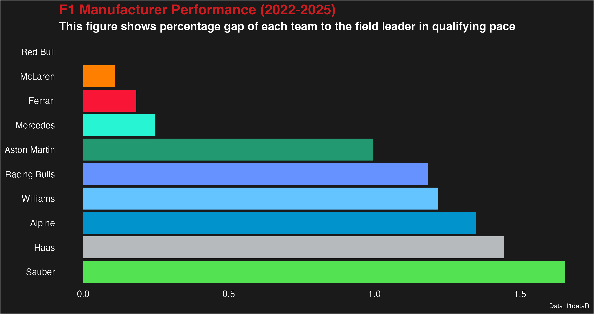

```{r, include = FALSE}
knitr::opts_chunk$set(
  collapse = TRUE,
  comment = "#>", 
  fig.path = "man/figures/README-", # Organizes images into a specific folder
  dpi = 300                         # Ensures crisp images on GitHub
)
```

# 🏎️ F1 Data Stories: Decoding the 2026 Regulation Shift


> **"Data doesn't just tell us who won; it tells us *why*."**

## 📖 Project Overview

**F1 Data Stories** is a longitudinal analysis project designed to bridge the gap between raw telemetry and narrative storytelling. While traditional standings tell us who scored the most points, this project digs deeper into the **engineering reality** underneath the results.

As the sport approaches the massive **2026 Technical Regulations** (active aerodynamics, 50/50 power split), accurate historical benchmarking is critical. This repository establishes a rigorous **Technical Competency Baseline** for the current "Ground Effect" era (2022-2025), allowing us to measure exactly how much the competitive order reshuffles when the new rules drop.

---

## 🔬 The Methodology: Defining "Technical Competency"

To understand who is truly winning the engineering war, we must look beyond the Championship Points. Points can be influenced by luck, strategy errors, or reliability issues. Instead, we aim to measure **Pure Car Performance**.

### 1. The Metric: Qualifying "Supertimes"
We utilize **Qualifying Pace** as our primary indicator of technical competency.
* **Why Qualifying?** Race results are noisy. They are polluted by traffic, tire management, and safety cars. Qualifying represents the **theoretical maximum performance** of the machine over a single lap, stripped of external variables.
* **The Calculation:** For every Grand Prix from 2022 to 2025, we identify the **Pole Position time** (100.000%) and calculate every other team's percentage deficit to that benchmark.

$$\text{Gap \%} = \left( \frac{\text{Team Best Time}}{\text{Pole Time}} - 1 \right) \times 100$$

*Note: We take the fastest time between a team's two drivers to represent the chassis's true potential. Wet sessions are filtered out to preserve data integrity.*

### 2. The Weighting: Engineering Momentum
A simple average of the last 4 years would be misleading. In Formula 1, car development is iterative. The car a team fields in 2025 is a direct evolution of their 2024 chassis, which evolved from 2023.

To account for this **recency bias** and **engineering momentum**, we apply a **Weighted Moving Average** to the performance deficits:

| Season | Weight | Rationale |
| :--- | :--- | :--- |
| **2025** | **40%** | **Current State of the Art:** Represents current wind tunnel correlation and staff quality. |
| **2024** | **30%** | **Immediate Foundation:** The direct predecessor to the current car. |
| **2023** | **20%** | **Legacy Knowledge:** The team's grasp of the core regulation concepts. |
| **2022** | **10%** | **Origins:** The team's initial adaptation to ground effect physics. |

This formula yields the **Technical Competency Index**—a single number representing a team's expected performance deficit entering the new era.

$$\text{Index} = \frac{\sum (\text{Gap} \times \text{Weight})}{\sum \text{Weight}}$$

---

## 📊 The Baseline: 2022-2025 Era Performance

Below is the **Technical Competency Index**. It ranks every constructor based on their weighted average qualifying gap to the field leader.

**The Zero Line (Baseline):** The team at `0.0` represents the "Gold Standard" of the era. Every other bar represents the pure engineering deficit to that standard.



