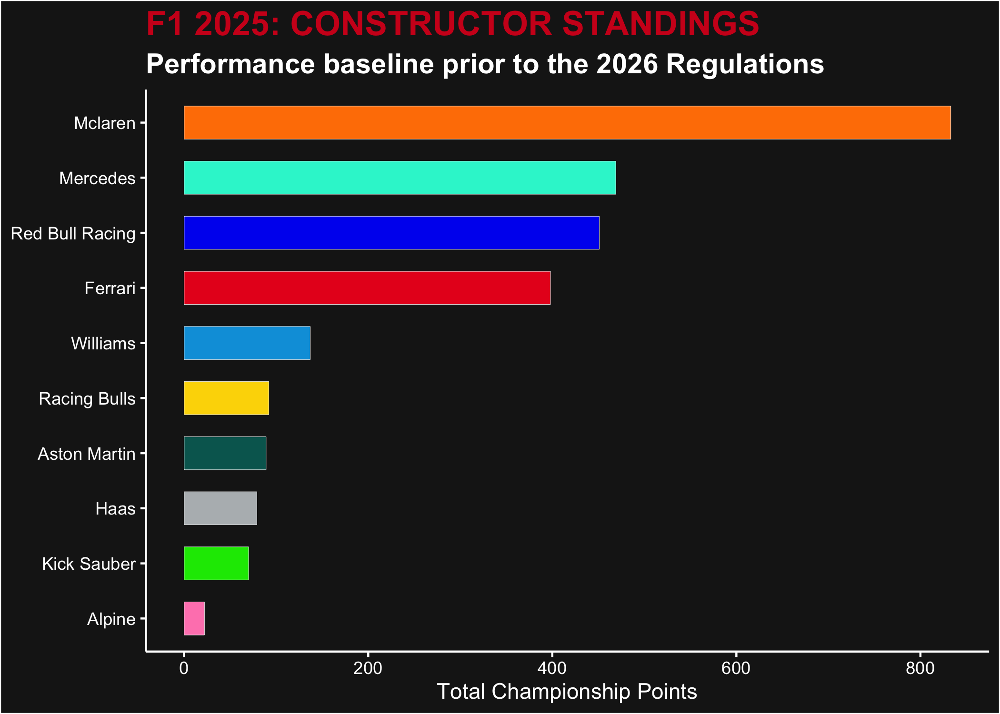

# F1 Stories: Data-Driven Narratives

<!-- badges: start -->

<!-- badges: end -->

This project is a deep dive into Formula 1 telemetry and results, with a
specific focus on the 2026 Technical Revolution. While many look at the
standings, “F1 Stories” looks at the “why.”

## Key Research Questions:

- The Hybrid Shift: How does the 50/50 ICE-to-Electric power split
  change driver throttle application?

- The Aero Game: Visualizing the impact of active aerodynamics on
  straight-line speed.

- The Teammate Duel: Who is winning the internal battle when the car is
  a “black box” of new regulations?

## 2025 Performance Baseline

Before diving into the 2026 data, we establish a baseline using the
final standings of the 2025 season.

<!-- -->
